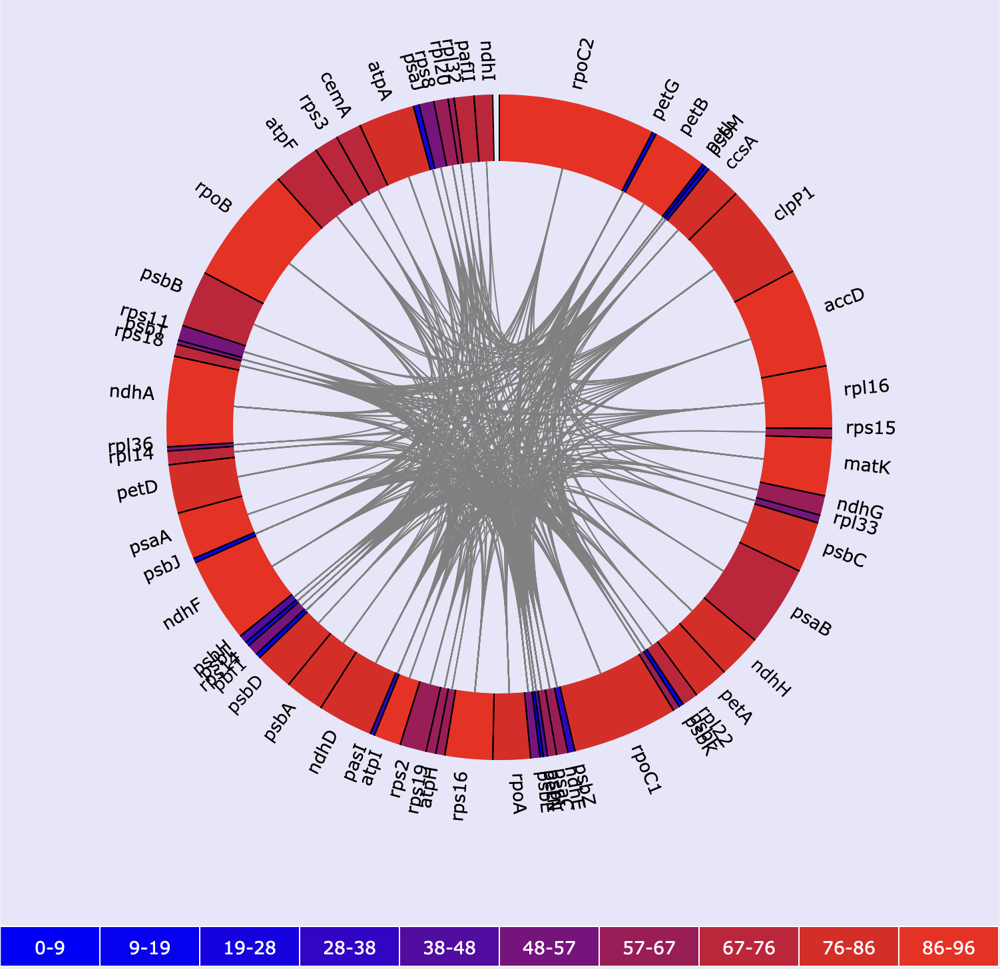

# Bayesian Phylogenetic Information Content

#### Dev Notes:
* Test files run start to finish. Produces results.html that can be viewed stand-alone
* Locus-based file arrangement untested

#### To Do
* Add CDS option for coding site partitioning
* Add options for processing AA seqs

## Overview
Script for batch processing of homologous loci for up to ~12 taxa to calculate Bayesian phylogenetic information content in the data. Steps:

1. Input data can be a FASTA file for each taxon containing one sequence for each locus, or a FASTA a file for each locus containing one sequence per taxon, or FASTA format alignments. 
2. Sequence alignment (via MAFFT or Clustal Omega).
3. Tree inference and marginal likelihood calculations (via Mr. Bayes)
4. Analyze information content (via Galax)


#### Example output (click to view interactive version)

<a href ="assets/results.html"></a>

## Installation
Clone github repo
```
git clone https://github.com/pschafran/BPIC.git
```

#### Dependencies
* Python 3.6
* BioPython [https://biopython.org/](https://biopython.org/)
* ETE Toolkit [http://etetoolkit.org/download/](http://etetoolkit.org/download/)
* MAFFT [https://mafft.cbrc.jp/alignment/software/](https://mafft.cbrc.jp/alignment/software/) and/or Clustal Omega [http://www.clustal.org/omega/](http://www.clustal.org/omega/)
* MrBayes [https://nbisweden.github.io/MrBayes/download.html](https://nbisweden.github.io/MrBayes/download.html)
* Galax [https://github.com/plewis/galax](https://github.com/plewis/galax)

In my experience on macOS, using Conda to install MAFFT and Clustal Omega works, MrBayes works best when installed through Homebrew. Installing in a new environment is recommended to avoid conflicts if other conda packages are already installed:

```
conda create -n BPIC -c bioconda -c conda-forge -c etetoolkit mafft clustalo ete3 ete_toolchain python=3.6
conda activate BPIC
pip install biopython
```

The base `BPIC` directory contains an empty directory where you can link dependencies if they are not read directly from the `PATH` variable. In particular, software installed with Conda may not be autodetected by `BPIC`. If you are able to call the program directly in a Terminal, you can do:

```  
cd BPIC/dependencies
ln -s $(which mafft)
ln -s $(which clustalo)
ln -s $(which galax)
ln -s $(which mb)
```
If executables are not in the Terminal's `PATH`, you can link to the absolute path of the file:

```
cd BPIC/dependencies
ln -s /Users/peter/bin/galax-1.1.0-mac/galax1 galax
etc.
```
Alternatively, paths can be provided on the command line when the program is run:

```
BPIC.py -i input_files -o output -f taxon --mafft-path /Users/peter/opt/miniconda3/bin/mafft --mrbayes-path /opt/homebrew/bin/mb ...

```

**NOTE ON CALLING DEPENDENCIES** 

The order of priority is: command line > linked in `BPIC/dependencies` > autodetected from the `PATH` shell vairable. I.e. if you specify one version of a program on the command line, it will ignore the versions of that program in other locations. And if nothing is specified on the command line, it will use the version linked in `BPIC/dependencies` over one found in the `PATH`.  

## Test Run
Once dependencies are installed and/or linked, you can test everything it working with the files included in the `test` directory. It takes about 5 minutes to run with 24 threads on a desktop computer, or about 1 hour with 4 threads on a MacBook Air.
```
cd BPIC/test
../BPIC.py -i . -o output -t 4 -f taxon
```

## Input Data Formatting
Input data can be a FASTA file for each taxon containing one sequence for each locus, or a FASTA a file for each locus containing one sequence per taxon. In either case, sequence names must be identical across files for each taxon/locus. Example formatting below:
### File for each taxon (e.g. exported from Geneious annotations)
Taxon1.fasta

```
>Gene1
ATGCAGCTGCTGATCGATGCTAATGCTGATCGTCAGTCGTAGTAGCTAGCTAGT
>Gene2
GCGATGCGCGATCGATGCTGGCTAGCTGCTAGTCATGCTGTAGCTAGTCGTGCA
>Gene3
CGATCGATCGTAGTGCTGATGCTGTAGTCGTGTAGCTAGCTGTAGTCAGTAGCT
```
Taxon2.fasta

```
>Gene1
ATGCAGCTGCTCGTAGCTCGTACGTCAGATGCTAGTCTCGTAGTAGTAGCTAGT
>Gene2
GCGATGCGCGATCGATCGATGCATGCTATCGATGCTGTGTAGCGCAGTCGTGCA
>Gene3
CGATCGATCGTAGTACGTCGTAGCTAGCTAGTCTAGCTAGTGTAGTCAGTAGCT
```
### File for each locus (e.g. output from Orthofinder)
Locus1.fasta

```
>Taxon1
ATGCAGCTGCTGATCGATGCTAATGCTGATCGTCAGTCGTAGTAGCTAGCTAGT
>Taxon2
GCGATGCGCGATCGATGCTGGCTAGCTGCTAGTCATGCTGTAGCTAGTCGTGCA
>Taxon3
CGATCGATCGTAGTGCTGATGCTGTAGTCGTGTAGCTAGCTGTAGTCAGTAGCT
```
Locus2.fasta

```
>Taxon1
ATGCAGCTGCTGATCGATGCTAATGCTGATCGTCAGTCGTAGTAGCTAGCTAGT
>Taxon2
GCGATGCGCGATCGATGCTGGCTAGCTGCTAGTCATGCTGTAGCTAGTCGTGCA
>Taxon3
CGATCGATCGTAGTGCTGATGCTGTAGTCGTGTAGCTAGCTGTAGTCAGTAGCT
```

## Running
Call the main script `BPIC.py` from command line. At minimum, you must specify the path to the directory containing all the input FASTA files and the format of the files (taxon or locus based as described above). Other parameters are:

```
Required parameters
-i, --input	Directory containing FASTA files
-f, --format	Input file format (either locus, taxon, or alignment)

Optional parameters (require a value after the flag)
-a, --aligner	Alignment software (either mafft or clustal; default: mafft)
-l, --log	Log file name. File includes more details than screen output (default: printed to screen/STDOUT) // TODO
-o, --output	Output directory name (default: output)
-t, --threads	Maximum number of threads to use (default: 1)

Optional flags (do not require a value after the flag)
--CDS	Partition MrBayes analysis by coding site
--PROT	Analyze sequences as amino acids // TODO
--force Overwrite existing results

MrBayes Parameters - values must be recognized by MrBayes (see https://nbisweden.github.io/MrBayes/manual.html)
--mrbayes-nst	Substitution model
--mrbayes-rates	Model for among-site rate variation
--mrbayes-ngen	Number of cycles for MCMC
--mrbayes-burninfrac	Proportion of samples to be discarded for convergence calculation (burn-in)
--mrbayes-samplefreq	How often to sample the Markov chain
--mrbayes-nsteps	Number of steps in the stepping-stone analysis

Help
-c, --cite	Show citation information
-h, --help	Show this help menu
-v, --version	Show version number

Advanced
--mrbayes-path	Path to MrBayes executable
--mafft-path	Path to MAFFT executable
--clustal-path	Path to Clustal executable
--galax-path	Path to Galax executable
--timeout	Minutes to run MrBayes analyses before killing process and restarting
--continue	Resume a previously interrupted run. Must specify stage to resume (`alignment` or `mrbayes`) 
```

## Run Time
Run time is highly dependent on individual system resources (# CPUS, CPU speed) and the number of taxa and genes in the analysis. In my experience, datasets of ~70 genes with 5-10 taxa will take 24-36 hrs on a 24 CPU machine.

## Output
In the output directory, you will see a file called `results.html`, and three directories. Output structure:

```
└── output
    ├── alignments
    │   └── nexus
    │       └── information_content
    ├── sequence_files
    ├── tree_info
    └── results.html
```


1. `sequence_files` contains the sequence files either directly as input (if pre-formatted as loci or alignments) or after sorting loci if input files are formatted as taxa. 
2. `alignments` contains alignments of the sequence files either produced by the script or copied from input if they were already aligned. A sub-directory of `alignments` called `nexus` contains the alignments converted to nexus format (with MrBayes command blocks) and all MrBayes output files. The sub-directory `information_context` contains nexus alignments and MrBayes output files used for calculating information content of trees. **WARNING:** The `nexus` directory can contain thousands of files, recommend only navigating here in Terminal.
3. `tree_info` contains input and output files for Galax, and a table summarizing marginal likelihoods for each pair of loci.
4. `results.html` graphically displays all infomation, showing links between genes with potentially conflicting topologies, determined by concatenated analysis having a higher marginal likelihood than sum of separate analyses. Information content of each gene is indicated by color, and shown interactively when the mouse cursor hovers over each gene. 


## MrBayes Bug Workaround
A bug in MrBayes causes some analyses of **concatenated genes with unlinked branch lengths** to get stuck and never finish. To work around this, this script sets a maximum run time for each MrBayes analysis (30 minutes by default, or user specified with `--timeout`). When an analysis times out, it is rerun until it finishes successfully, each time using a new seed/swapseed value and doubling the timeout length (to avoid cutting off jobs that just need more time to finish). Usually this works without requiring any user input, but in case it still fails to finish, the script can be manually stopped (ctrl+c, etc.), and restarted by adding `--continue mrbayes` to the original command line. This should allow the script to finish normally. 

If the script fails with errors occurring during the `extractMargLik()` function, it is probably caused by unfinished MrBayes runs still sneaking past my checks. 

## BEAGLE
DO NOT USE! It causes MrBayes analyses to fail. In case BEAGLE was installed along with MrBayes, all the nexus files contain a `set usebeagle=no` line which should prevent any issues. But if you are troubleshooting problems, double check this.  

## References

Paul O. Lewis, Ming-Hui Chen, Lynn Kuo, Louise A. Lewis, Karolina Fučíková, Suman Neupane, Yu-Bo Wang, Daoyuan Shi, Estimating Bayesian Phylogenetic Information Content, Systematic Biology, Volume 65, Issue 6, November 2016, Pages 1009–1023, https://doi.org/10.1093/sysbio/syw042

Suman Neupane, Karolina Fučíková, Louise A Lewis, Lynn Kuo, Ming-Hui Chen, Paul O Lewis, Assessing Combinability of Phylogenomic Data Using Bayes Factors, Systematic Biology, Volume 68, Issue 5, September 2019, Pages 744–754, https://doi.org/10.1093/sysbio/syz007

Galax. https://github.com/plewis/galax

ETE 3: Reconstruction, analysis and visualization of phylogenomic data. Jaime Huerta-Cepas, Francois Serra and Peer Bork. Mol Biol Evol 2016; doi: 10.1093/molbev/msw046
